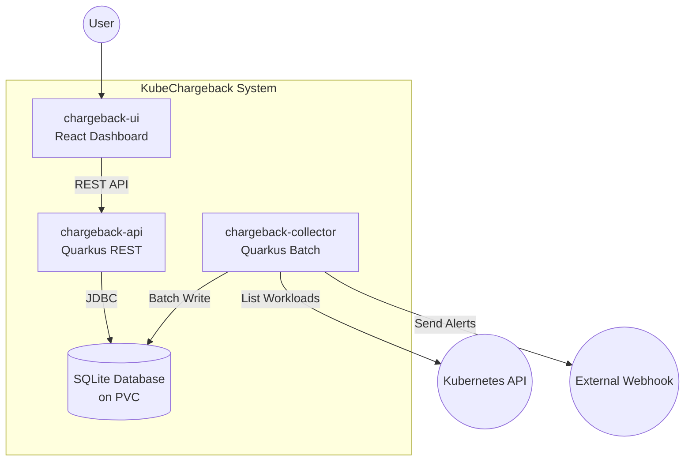
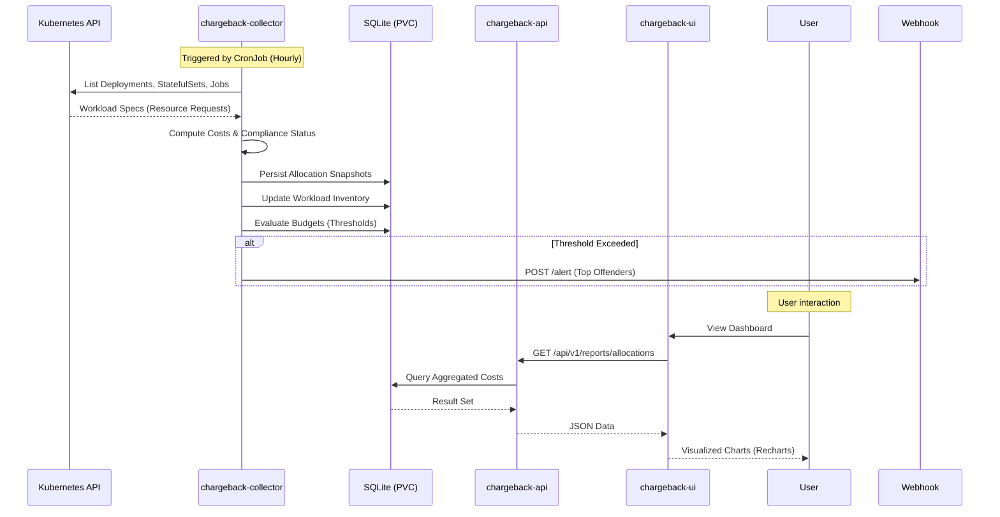

# KubeChargeback

Lightweight Kubernetes showback/chargeback tool. It consists of a **CronJob collector** that aggregates CPU/RAM requests into cost units and a **REST API** that serves allocation and compliance reports.

## Architecture

- **chargeback-api**: Quarkus REST service for budget management and reporting. Includes **Swagger UI**.
- **chargeback-collector**: Quarkus batch application (CronJob) that scans Kubernetes workloads.
- **chargeback-ui**: React-based Dashboard (Vite) for visual cost analysis and compliance monitoring.
- **chargeback-common**: Shared models and utilities.
- **Persistence**: Shared SQLite database stored on a PersistentVolumeClaim (PVC).

## System Architecture



## Data Flow & Operations



## Features

- **Automated Collection**: Periodically scans Kubernetes workloads (Deployments, StatefulSets, DaemonSets, and Jobs).
- **Accurate Job Costing**: Specifically handles Batch Jobs and CronJobs, calculating costs based on actual execution duration.
- **Resource Compliance**: Identifies workloads missing CPU/Memory requests or limits, providing a "Compliance Score" for the cluster.
- **Team-based Chargeback**: Groups costs by Namespace or Team using customizable Kubernetes labels.
- **Intelligent Alerting**: Monitor resource budgets with configurable thresholds (Warn/Critical) and automated Webhook notifications.
- **Interactive Dashboard**: Modern React UI with visual charts (Recharts) for cost analysis and compliance monitoring.
- **Audit-Ready**: Export allocation reports to **CSV** for further financial analysis.
- **Developer Friendly**: Full **Swagger UI** integration for API exploration and SQLite persistence for simple deployment.

## Getting Started

### Prerequisites

- Java 21+
- Maven 3.8+ (or use the provided `./mvnw`)
- Node.js 18+ and npm (for the UI)
- A Kubernetes cluster context (k3s, minikube, kind, OpenShift)

### Build and Containerization

To build the project and create Docker images:
```bash
./mvnw clean package -DskipTests
docker build -f chargeback-api/src/main/docker/Dockerfile.jvm -t kubechargeback/chargeback-api:latest chargeback-api
docker build -f chargeback-collector/src/main/docker/Dockerfile.jvm -t kubechargeback/chargeback-collector:latest chargeback-collector
docker build -t kubechargeback/chargeback-ui:latest chargeback-ui
```

### Running Locally (Development)

The project includes a convenient script to start all components:
```bash
./scripts/run-all.sh
```
Or manually:
1. **Backend**: `./mvnw -f chargeback-api/pom.xml quarkus:dev` (Default: port 8080)
2. **Frontend**: `cd chargeback-ui && npm install && npm run dev` (Default: port 5173)
3. **Collector**: `./mvnw -f chargeback-collector/pom.xml quarkus:run -Dquarkus.args="--once"`

### Run Tests

To run all unit and integration tests:
```bash
./mvnw test -Dquarkus.http.test-port=0
```

### Deployment

The project is ready for deployment using Kustomize:
```bash
kubectl apply -k manifests/base
```

## Configuration

Configuration is managed via the `kubechargeback-config` ConfigMap or `application.properties`. Key properties include:
- `rate.cpu_mcpu_hour`: Cost per 1000m CPU per hour.
- `rate.mem_mib_hour`: Cost per 1 MiB memory per hour.
- `label.team`: Label key used to identify teams (default: `team`).
- `namespace.allowlist`: CSV list of namespaces to monitor (empty means current namespace only).
- **Note**: The SQLite database uses **WAL (Write-Ahead Logging)** mode to allow concurrent access between the API and the Collector.

## API & Documentation

The API is available at `/api/v1`. 
- **Swagger UI**: Access interactive documentation at `/q/swagger-ui` (e.g., `http://localhost:8080/q/swagger-ui`).
- **Dashboard**: Access the UI at `http://localhost:5173` (during development) or the configured Route/Ingress.

Available endpoints:
- `/budgets`: CRUD operations for resource budgets.
- `/reports/allocations`: Aggregated resource consumption data.
- `/reports/allocations/export`: Export allocation data to **CSV**.
- `/reports/top-apps`: Most expensive applications (supports `team` filter).
- `/reports/compliance`: Inventory of workloads with resource specification issues.
