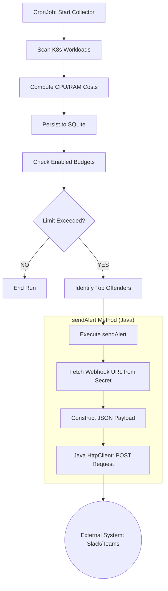

# KubeChargeback

Lightweight Kubernetes showback/chargeback tool. It consists of a **CronJob collector** that aggregates CPU/RAM requests into cost units and a **REST API** that serves allocation and compliance reports.

## Architecture

- **chargeback-api**: Quarkus REST service for budget management and reporting. Includes **Swagger UI**.
- **chargeback-collector**: Quarkus batch application (CronJob) that scans Kubernetes workloads.
- **chargeback-common**: Shared models and utilities.
- **Persistence**: Shared SQLite database stored on a PersistentVolumeClaim (PVC).

## Features

- **Resource Footprint**: Based strictly on Kubernetes `resources.requests`.
- **Workload Support**: Monitors `Deployments`, `StatefulSets`, and `DaemonSets`.
- **Budgeting**: Supports `TEAM` and `NAMESPACE` budgets with configurable alert thresholds.
- **Reporting**:
  - Global and team-based application cost reports (powered by SQLite JSON support).
  - Compliance reports identifying workloads with missing resource specifications.
- **Alerting**: HTTP webhook notifications with a list of **Top Offenders** (most expensive apps) included in the alert payload.

## Alert Webhook Flow



## Getting Started

### Prerequisites

- Java 21+
- Maven 3.8+ (or use the provided `./mvnw`)
- A Kubernetes cluster (k3s, minikube, kind, OpenShift)

### Build and Containerization

To build the project and create Docker images:
```bash
./mvnw clean package -DskipTests
docker build -f chargeback-api/src/main/docker/Dockerfile.jvm -t kubechargeback/chargeback-api:latest chargeback-api
docker build -f chargeback-collector/src/main/docker/Dockerfile.jvm -t kubechargeback/chargeback-collector:latest chargeback-collector
```

### Run Tests

To run all unit and integration tests:
```bash
./mvnw test -Dquarkus.http.test-port=0
```

### Deployment

The project is ready for deployment using Kustomize:
```bash
kubectl apply -k manifests/base
```

## Configuration

Configuration is managed via the `kubechargeback-config` ConfigMap. Key properties include:
- `rate.cpu_mcpu_hour`: Cost per 1000m CPU per hour.
- `rate.mem_mib_hour`: Cost per 1 MiB memory per hour.
- `label.team`: Label key used to identify teams (default: `team`).
- `namespace.allowlist`: CSV list of namespaces to monitor (empty means current namespace only).

## API & Documentation

The API is available at `/api/v1`. 
- **Swagger UI**: Access interactive documentation at `/q/swagger-ui` (e.g., `http://localhost:8080/q/swagger-ui`).

Available endpoints:
- `/budgets`: CRUD operations for resource budgets.
- `/reports/allocations`: Aggregated resource consumption data.
- `/reports/top-apps`: Most expensive applications (supports `team` filter).
- `/reports/compliance`: Inventory of workloads with resource specification issues.
